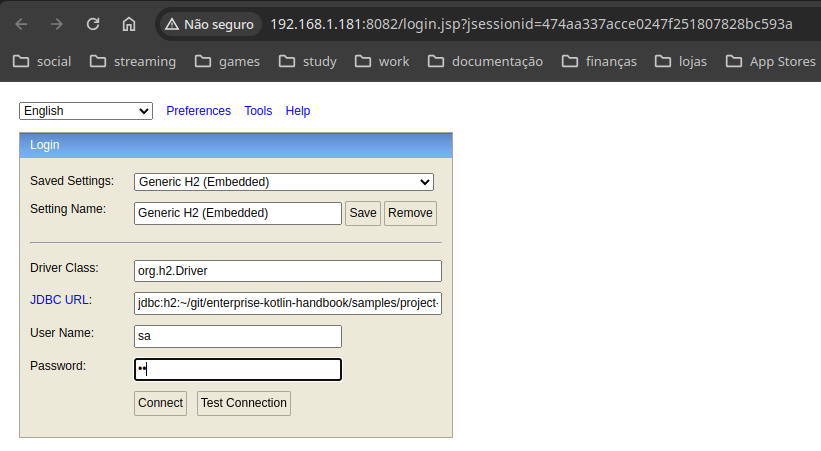
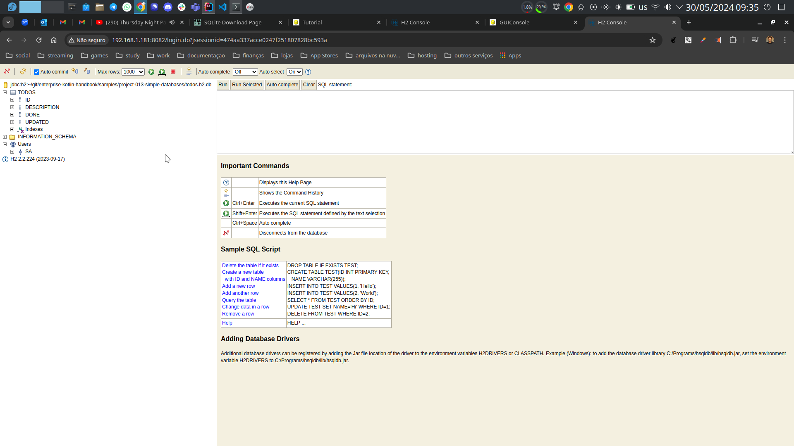

# Simple database example

How to make code query the database for you.

[Databases are not spreadsheets][dans] and the best way to interact with them is
writing an application.

This brutally simple example shows how to do that using the kotlin language.
This is not a production, enterprise example, but it's needed to better absorb
following samples.

## How to Build

Fist, make sure you have the needed database drivers. They are supposed to be in
the **lib** folder.

```bash
kotlinc src/**/*.kt -include-runtime -d db-manage.jar
```

## How to run

You must include the jdbc drivers in the runtime classpath. Example with h2:

```bash
java -cp lib/h2-2.2.224.jar:db-manage.jar project013.QueryDbKt h2
```

Example with sqlite (it has an extra dependency on [sl4j][sl4j]):

```bash
java -cp \
lib/slf4j-api-2.0.9.jar:\
lib/slf4j-simple-2.0.9.jar:\
lib/sqlite-jdbc-3.45.3.0.jar:\
db-manage.jar project013.QueryDbKt sqlite
```

## Checking the databases

If you ran the program and performed at least one operation (list,insert, etc),
the database file is supposed to be present in the directory now:

```console
$ ls -lha
total 5,0M
drwxr-xr-x. 1 sombriks sombriks  242 mai 30 09:36 .
drwxr-xr-x. 1 sombriks sombriks  738 mai 30 08:27 ..
-rw-r--r--. 1 sombriks sombriks 4,8M mai 30 09:17 db-manage.jar
-rw-r--r--. 1 sombriks sombriks 167K mai 30 09:35 h2-admin-console.png
-rw-r--r--. 1 sombriks sombriks  38K mai 30 09:33 h2-console-login.png
drwxr-xr-x. 1 sombriks sombriks  158 mai 30 08:27 lib
-rw-r--r--. 1 sombriks sombriks 3,6K mai 30 09:36 README.md
drwxr-xr-x. 1 sombriks sombriks   20 mai 30 08:27 src
-rw-r--r--. 1 sombriks sombriks  20K mai 30 09:37 todos.h2.db.mv.db
-rw-r--r--. 1 sombriks sombriks 1,4K mai 30 09:31 todos.h2.db.trace.db
-rw-r--r--. 1 sombriks sombriks  12K mai 30 09:23 todos.sqlite3.db
```

Each database runtime has different tools to permit you to check how's your data
is doing.

For sqlite, [install the command line tool][sqlite] and try this:

```bash
sqlite3 todos.sqlite3.db
> .tables
todos
> insert into todos (description) values ('new task');
> select * from todos;
1|new task|0|2024-05-30 12:23:36
```

Hit `CTRL+C` a couple of times to go back to the regular terminal.

For H2, the jar file contains a nice, web-based admin application. Try this, it
will pop up a browser window. Use path for your database file in the *JDBC URL*
field, something like `jdbc:h2:~/git/enterprise-kotlin-handbook/samples/project-013-simple-databases/todos.h2.db`
and use the same credentials (username `sa`, password `sa`) used in the Kotlin
code:

```bash
java -jar lib/h2-2.2.224.jar
```



The interface is pretty decent:



## Noteworthy

- In old jvm versions, you had to explicitly load the database driver using
  [Class.forName()][forName], but [modern drivers][jdbc4]` does that
  automatically, they just need to be present in classpath. That's why we have
  classpath parameter for run but not to compile.
- While sqlite3 offers a [command line tool][sqlite] to quick database
  inspection, H2 offers a [web-based admin tool][h2].
- The JDBC API is quite verbose and fine-grained, which is bad if you just want
  to get things done. This is why [so many][hibernate] [other database][mybatis]
- [access libraries][jdbi] [where built][jpa] on top of it. We'll check some of
  them in other projects.
- As an **exercise**, improve the command line used to run the application, if
  possible by unifying it into a single command for both database engines.
- A second **exercise** is to add a third database driver of your choice and
  make it work.

[dans]: https://spreadsheetplanet.com/database-vs-spreadsheet/
[forName]: https://docs.oracle.com/javase/8/docs/api/java/lang/Class.html#forName-java.lang.String-
[jdbc4]: https://docs.oracle.com/javase/8/docs/api/java/sql/DriverManager.html
[sqlite]: https://www.sqlite.org/download.html
[h2]: https://h2database.com/html/tutorial.html#tutorial_starting_h2_console
[sl4j]: https://www.slf4j.org/
[hibernate]: https://hibernate.org/
[mybatis]: https://mybatis.org/mybatis-3/index.html
[jdbi]: https://jdbi.org/
[jpa]: https://jakarta.ee/learn/docs/jakartaee-tutorial/current/persist/persistence-intro/persistence-intro.html
